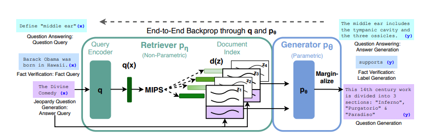
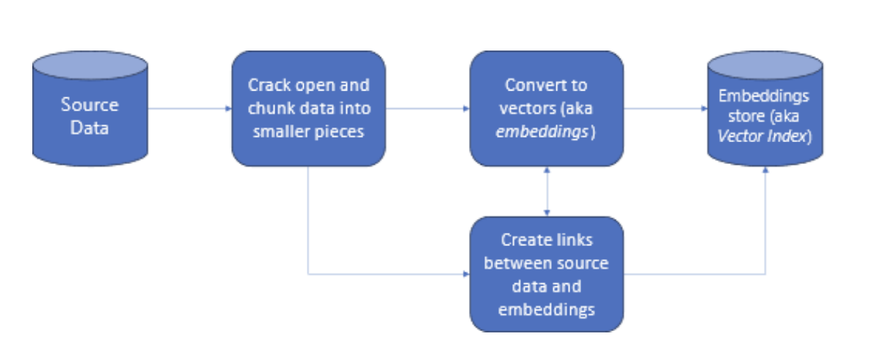

### The original paper:

https://arxiv.org/abs/2005.11401

Summary:

RAG stands for "Retrieval-Augmented Generation"
This breakthrough in NLP is designed for taks that need access to a lot of external information. 
A simple promotp and finetuning will not generate accurate answer.

MIPS stands for "Maximum Inner Product Search."
MIPS problem: 
Given a query vector and a pool of "n" vectors, find the vector that has the highest inner product with the query vector among all.
argmax<x_i,q> for i in Space

Using MIPS to find the top k vectors/documents . The output of MIPS will be "k" documents. These k documents will be inputs to a k seq2seq models combined with the query. Th eoutputs of seq2seq will be input to generator. Then they gets marginalized and the output is the prediction "y". 

Models:

Retriever: DPR
DPR is a bi-encoder architecture
There are two encoders(bi-encoder), one for BERT for the query, one BERT for the document and then cosine similarity.

The Genrator: BART large, a seq2seq transformer
Training:
minimizing the minus log-likelihood , using SGD and ADAM

Decoding:

Fast decoding and Thorough decoding.
Thorough decoding doesn't use single beam seach. it runs beams search for each document. To estimate the probability for each y, it runs and extra forward pass for each documnet z where y is not in the beam.
Fast decoding is for long output sequence |Y| and run forward pass when the  |Y| is geenrated as we skip running forwardpass when the y is not in the set of (x,zi)

Common indexing:

Langchain, LLAMA index

Common techs:
FAISS, AWS extract, 

The biggest challenge of RAG:
Documents a lot of times need to be processed before putting in the vector database. Otherwise, it will impact the accuracy.
Adding Human in the loop can also help with not too high accuracy.
Sometimes the embeddings of the query might result in finding the top n documents that actually don't include the answer. Constantly changing the params becomes one of the tasks during the inference.

The RAG-teachers notebook is a very straight forward RAG implementation. This notebook is created as an example. More challenging projects are also in progress.

In projects with very large number of vector doc, efficient vectorflows can be helpful for semantic search. Vectorflows are another topic of interest.

